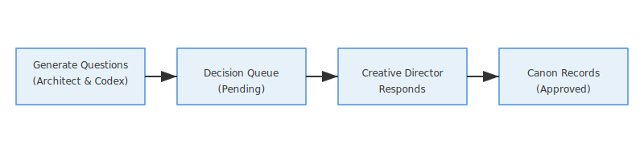

# How to Integrate Flow Diagrams v01

This guide explains how to incorporate the flow diagrams from **Flow Diagrams v01** into the Decision Console’s documentation and UI.  Each SVG illustrates a specific aspect of the decision process; integrating them properly will enhance clarity and user understanding.

## 1. File Locations

All diagrams are stored in the `console/flows_v01/` directory:

```
console/
  flows_v01/
    decision_flow.svg
    revision_flow.svg
    project_category_mapping.svg
    logic_flow.svg
    summary_FLOW_DIAGRAMS_v01.md
    how_to_integrate_FLOW_DIAGRAMS_v01.md
    notes_FLOW_DIAGRAMS_v01.md
```

When integrating with the Decision Console UI or documentation, reference these files directly or copy them to the appropriate static asset location.  Because they are vector images, they scale cleanly on high‑resolution displays.

## 2. Embedding in Web Interfaces

To embed an SVG in an HTML page:

```html

```

Alternatively, inline the SVG code directly into the page for more control over styling.  When inlining, ensure that the `<defs>` section (where arrow markers are defined) is preserved to maintain arrowheads.

## 3. Usage in Documentation

If generating documentation in Markdown, you can include the diagrams using:

```markdown

```

Be mindful of relative paths depending on your documentation structure.  The diagrams can also be converted to PNG format for compatibility with systems that do not support SVG.

## 4. UI Integration Points

Consider integrating the diagrams in the following places:

* **Overview or onboarding page:** Present `decision_flow.svg` and `logic_flow.svg` to explain the basic workflow and user choices.
* **Revision management screen:** Display `revision_flow.svg` alongside the flagging interface so users understand how flags lead to new decisions.
* **Settings or configuration page:** Use `project_category_mapping.svg` to remind users how projects and categories are organized when they create or edit configuration.

## 5. Customization

The current SVG files use neutral colours aligned with the Atlasforge brand.  If you need to adjust colours or dimensions:

1. Open the SVG file in a text editor or vector graphics tool (e.g., Inkscape).
2. Modify the `<style>` definitions or shape attributes (e.g., `fill`, `stroke`, `width`, `height`).
3. Save the updated SVG and ensure that arrow markers (`marker-end="url(#arrow)"`) still reference existing `<defs>` entries.

Avoid adding text outside of `<text>` elements, as this may not scale or export well.  Use the existing text elements as templates for adding new labels.

## 6. Version Control and Asset Management

Place the SVGs in your repository’s static assets folder (e.g., `/console/flows_v01/`).  Use version control to manage updates; commit changes with descriptive messages indicating what changed (e.g., “Updated logic flow colours to match new brand palette”).

---

By following this guide, you can effectively integrate the flow diagrams into the Decision Console’s user interface and documentation, improving clarity for developers and users alike.